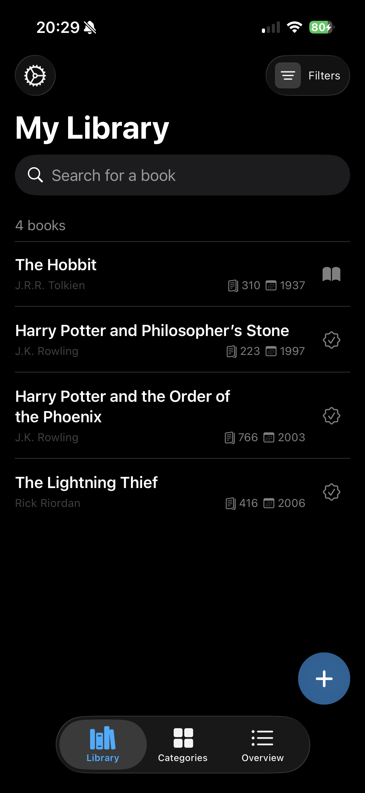
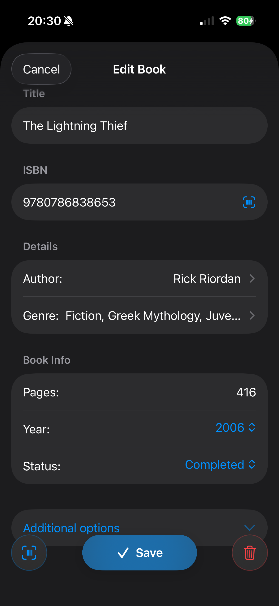
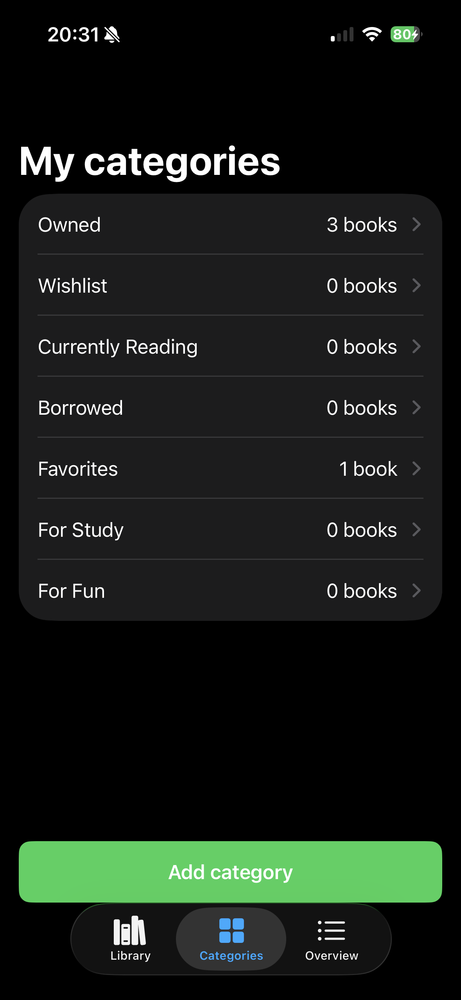
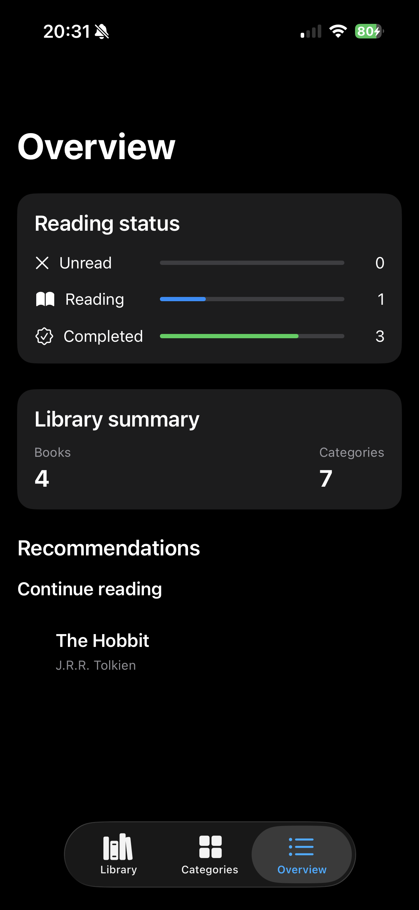

# 📚 HomeLibrary

> A personal book library manager for iOS - built with SwiftUI, Core Data, and MVVM.


HomeLibrary helps you organize, search, and manage your personal book
collection. It uses Core Data for persistent storage and supports
CSV/JSON import & export so your library is never locked in.

---

## 🎥 Demo

>  **Watch Demo:** [Watch a 2-minutes walkthrough](https://www.youtube.com/shorts/YzL1I5QJ0EM)

---

## 📸 Screenshots

| My Library | Add / Edit Book | Categories | Overview |
|:---:|:---:|:---:|:---:|
|  |  |  |  |

---

## ✨ Features

- ➕ Add, edit, and delete books with structured metadata
- 🗂 Organize with categories, authors, and genres using Core Data relationships
- 🔍 Search and filter your library in real time
- 💾 Persistent storage via Core Data with context rollback on save failure
- 📤 Import / export library data as CSV or JSON for backup and portability
- 📷 Barcode scanning to auto-fill book data
- 🎨 Clean, responsive UI built entirely in SwiftUI
- 🧪 Unit tests covering storage logic and CSV parsing
- ⚙️ CI on every push via GitHub Actions

---

## 🛠 Tech Stack

| Layer | Technology |
|---|---|
| Language | Swift 5 |
| UI | SwiftUI (UIKit where needed) |
| Architecture | MVVM |
| Persistence | Core Data |
| Testing | Swift Testing (`@Test`, `#expect`) |
| Tooling | Xcode, Git, SwiftLint, GitHub Actions |  

---

## 🏗 Architecture

The app follows **MVVM**:
```text
┌─────────────┐     ┌──────────────┐     ┌──────────────┐
│   View      │ ──▶ │  ViewModel   │ ──▶ │    Model     │
│  (SwiftUI)  │ ◀── │ (state/logic)│ ◀── │ (Core Data)  │
└─────────────┘     └──────────────┘     └──────────────┘
```
- **View** - SwiftUI views, purely declarative, no business logic
- **ViewModel** - `@Observable` classes holding state, filtering, and formatting
- **Model** - Core Data entities + plain value types (`Book`, `Author`, `Category`, `Genre`, `Publisher`)

The persistence layer is protocol-oriented: `CDStorage` conforms to
storage protocols (`BooksStorage`, `AuthorsStorage`, `CategoriesStorage`,
etc.), which allows fast, isolated unit tests using fakes instead of a
real Core Data stack.

---

## 💾 Data Management

- Core Data with **relationships** between `Book` and its `Author`,
`Category`, and `Genre` entities
- Context rollback on save failure - no silent data loss
- User-facing error surfacing in `EditBookView` when a save fails
- **CSV / JSON export** for backup and portability
- **CSV / JSON import** with a hand-rolled RFC 4180 CSV parser
- Data migrations handled via a versioned `managedObjectModel`

---

## 🔍 Key Highlights

- Scalable **MVVM** architecture with protocol-oriented storage
- Efficient data querying for **search** and **filter**
- **Testable business logic** decoupled from SwiftUI
- **Product-style implementation** — handles empty states, error states,
and context rollback
- Continuous refactoring visible in commit history (shared formatting 
extracted, duplicated views deduped, save failures surfaced)

---

## 🚀 Getting Started

### Requirements

- macOS with **Xcode 26.6+**
- **iOS 18+** simulator or device

### Run it

```bash
git clone https://github.com/4reta1l/HomeLibrary.git
cd HomeLibrary
open HomeLibrary.xcodeproj
```
Then press **⌘R** in Xcode.

### Run tests

```bash
xcodebuild test \
  -scheme HomeLibrary \
  -destination 'platform=iOS Simulator,name=iPhone 17 Pro'
```

---

## 🧪 Testing & CI

- Unit tests written with Swift Testing (`@Test`, `#expect`)
- Coverage includes:
  - `LibraryStore` (load, add, update, delete, search/filter/sort)
  - CSV parsing and round-trip (`CSVParserTests`, `CSVRoundTripTests`)
  - Core Data smoke tests (`StorageSmokeTests`)
- Fakes (`FakeBooksStorage`, `FakeAuthorsStorage`, ...) enable isolated tests
- GitHub Actions runs **build + tests + SwiftLint (`--strict`)** on every push
- CI uses `xcbeautify` for readable logs and cancels outdated runs

---

## 👤 Author

**4reta1l**
- GitHub: [4reta1l](https://github.com/4reta1l)
- University GitHub: [Maksym Pyvovarov](https://github.com/MaksymPyvovarov)
- LinkedIn: [Maksym Pyvovarov](https://www.linkedin.com/in/maksym-pyvovarov/)
- Email: [maxpyvovarov@gmail.com](mailto:maxpyvovarov@gmail.com)
